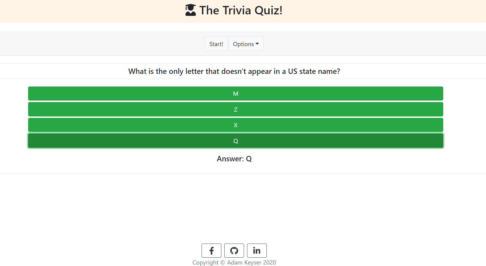
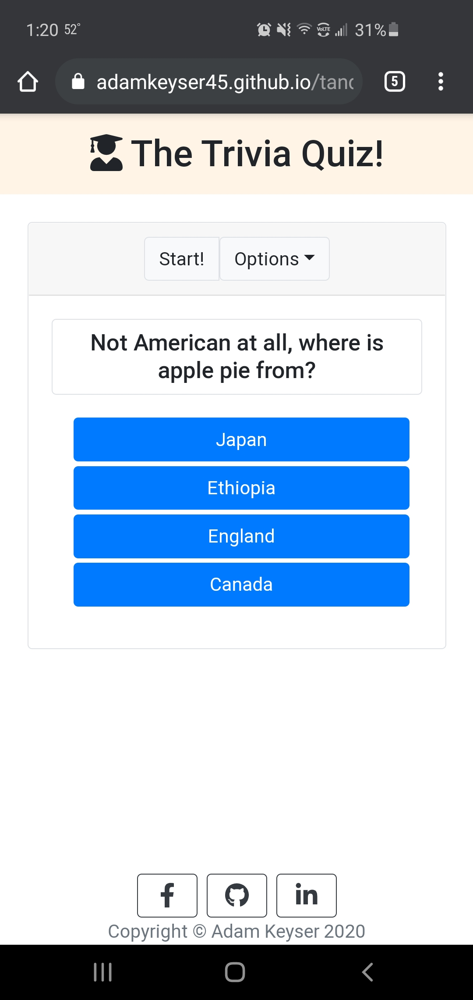

# The Tandem Quiz App!
This is an app to take a quiz to help you freshen up on trivia and pop culture!

## Table of Contents
- [Description](#description)
- [Assumptions](#assumptions)
- [Acceptance Criteria](#acceptance-criteria)
- [Available Scripts](#available-scripts)
- [How It Works](#how-it-works)
- [Considerations](#considerations)
- [Questions](#questions)

## Description

This project is a Quiz Application that can help you prepare for your next Trivia night! When the page loads you can start the game by pressing "Start!" or press the "Options" button to see the rules of the game or rest the quiz if you need to start over in the middle of the quiz.

### How to Play

1. Press "Start!" to begin the quiz.
1. Each quiz is 10 questions, chosen randomly from a list of 21, and each question will only be shown once.
1. Read the Trivia Question and choose one of the four answer choices.
1. If your answer is correct, the buttons will flash green, if it is incorrect, they will flash red.
1. When all of the questions are done, you should see your score. You get 10 points for each correct answer.
1. If you ever need to reset the quiz, click "Reset Quiz" in the "Options" menu.

**[Deployed Application](https://adamkeyser45.github.io/tandem-quiz/)**

### Screenshots

#### Desktop

#### Mobile

  
## Assumptions

* A round of trivia is 10 Questions.
* All questions are multiple-choice questions.
* The user's score does not need to update in real time.
* Results can update on any interaction.
* Trivia questions are provided by Tandem.

## Acceptance Criteria

* A user can view questions.
* Questions with their multiple choice questions must be deployed one at a time.
* Questions should not repeat in a round.
* A user can select only 1 answer out of the possible answers.
* The correct answer must be revealed after a user has submitted their answer.
* A user can see the score they receive at the end of the round.

## Available Scripts

In the project directory, you can run:

### `npm start`

Runs the app in the development mode. 
Open [http://localhost:3000](http://localhost:3000) to view it in the browser.

### `npm test`

Launches the test runner in the interactive watch mode. Make sure to press "a" in your terminal to run all of the tests. The provided tests make sure that each of the React Components render properly! 

## How It Works

The application uses React to render the page, and Bootstrap for styling. The page is divided up into three "components" (Header, Footer, and QuizBody) that are rendered in the App.js file, which displays it to the page. The main component, QuizBody, is where most of the action happens.

The application functions by using state in different parts of the QuizBody. The button colors, current question, score, questions, and even sections of the page are controlled by using state.

When a user presses the "Start!" button, it firsts, switches the "gameOff" state to true, sets the score back to zero, and then chooses ten random questions  from the JSON file using a "while loop" (The JSON file was modified to make it easier to dynamically generated and used around the app). The ten chosen questions are stored in a separate array to be used for the round.

Now that the questions are chosen, the app then dynamically loads the first question, and maps through the questions answer choices and creates a button for each one.

When a user chooses an answer, several things happen:
1. First, it checks to see if the answer chosen is correct by looking at the "choices" isCorrect property. If it is, then it adds 10 points to the score, and then changes all of the buttons to green. If not, it changes the color to red.
1. Then, the correct answer is displayed below the answer choices, whether or not it is correct.
1. Next, after 1 second, it checks to see if there have been 10 questions.
    * If there hasn't been ten questions, it changes the buttons color back to blue, hides the correct answer area, and advances to the next question.
    * If there has been 10 questions, then it calls the resetQuiz function, which will hide the quiz questions, reset the state of the currentQuestion to zero, and empties the array that holds the questions.
1. When the game is over, the score is displayed back on the "start screen", while the resetQuiz function runs as mentioned above.

## Considerations

Future Additional Features
* A High Score modal that allows a player to put in their initials when, and only when, they have gotten a high score.
* An form to add your own trivia questions to the game.
* Randomly mixing up the positions of the answers when they are generated.

Other Notes
* To really make sure that this is well tested, more testing will need to be added to make sure the various parts of the QuizBody component are functioning properly.

## Questions
✉️ Contact me with any questions: [email](mailto:adam.keyser45@gmail.com) , [GitHub](https://github.com/adamkeyser45) 
